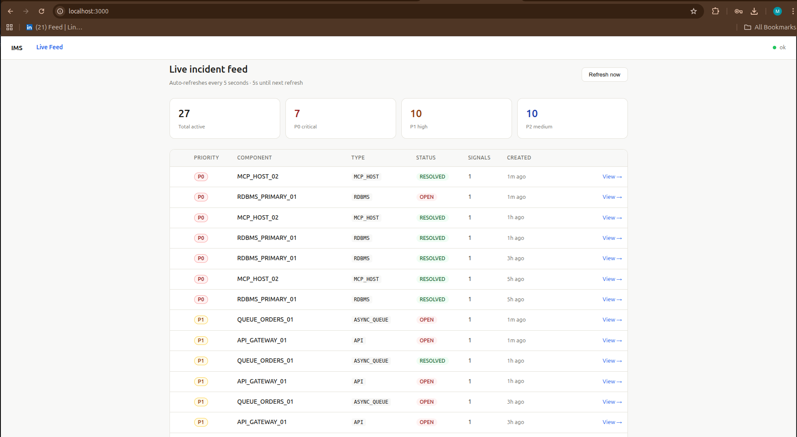
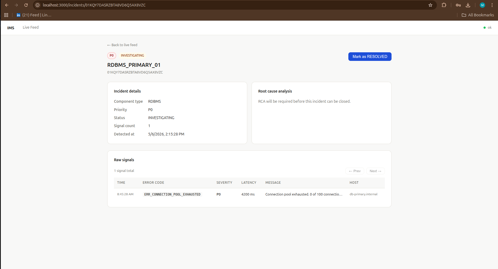
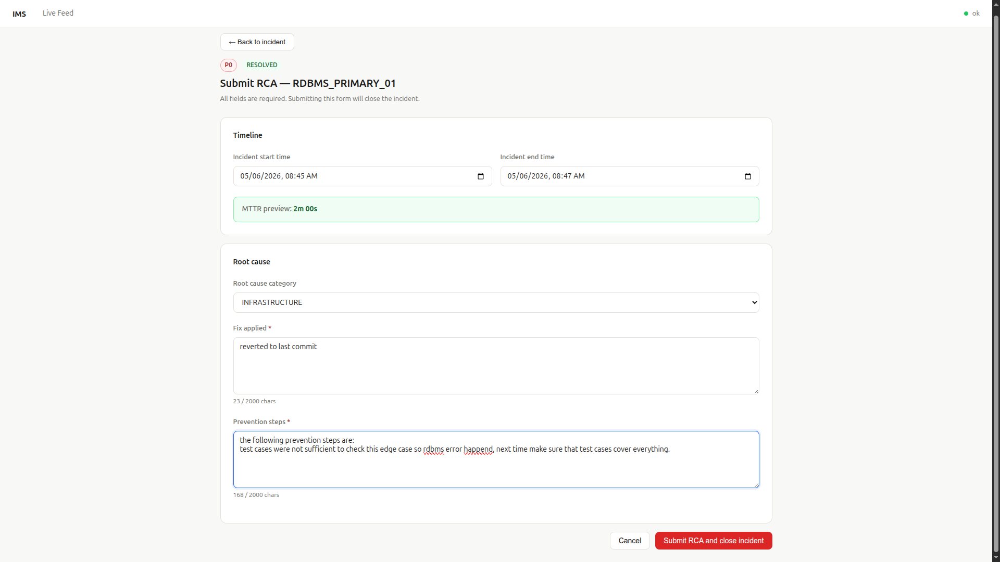
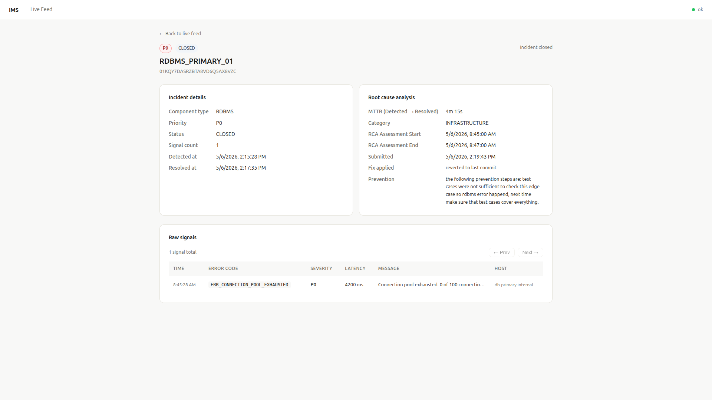

```markdown
# Incident Management System (IMS) - SRE Edition

A high-throughput, highly resilient Incident Management System designed to ingest, debounce, and correlate operational alerts at scale. This project is built with Site Reliability Engineering (SRE) principles to handle cascading failures and high-volume traffic without crashing.

## 🚀 Core Features

*   **High-Throughput Ingestion:** Capable of absorbing bursts of 10,000+ signals per second using asynchronous worker pools and a bounded in-memory queue.
*   **Distributed Debouncing:** Intelligently groups hundreds of duplicate alerts within a 10-second window into a single, actionable "Work Item" using Redis atomic operations (`SET NX EX`).
*   **Cascading Failure Correlation:** Automatically detects upstream dependencies (e.g., RDBMS failures causing API failures) and groups them visually for rapid Root Cause Analysis.
*   **Strict State Machine:** Enforces SRE postmortem culture by programmatically blocking the closure of incidents until a detailed Root Cause Analysis (RCA) is submitted.
*   **Hot-Path Caching:** Serves the Live Incident Dashboard directly from Redis sorted sets to protect the relational database from read-heavy refresh storms during an outage.

---

## 🏗️ Architecture:


### Tech Stack

*   **API Framework:** Python / FastAPI
*   **Frontend Framework:** React (Vite)
*   **Concurrency:** `asyncio` Task Groups & Worker Pools
*   **State Management (Source of Truth):** MySQL (with SQLAlchemy & Alembic for migrations)
*   **Debouncer & Hot Cache:** Redis
*   **Data Lake (Audit Log):** MongoDB
*   **Time-Series Metrics:** InfluxDB
*   **Load Testing:** `httpx.AsyncClient` & `pytest`

---

## 🛡️ Engineering Highlight: Backpressure & Resilience

An incident management system is often hit hardest exactly when the rest of the infrastructure is failing. To ensure this IMS remains highly available during a storm of cascading failures, it employs a **Two-Tiered Backpressure and Load Shedding Strategy**:

### 1. Tier 1: Noisy Neighbor Protection (Rate Limiting)

This is the first line of defense, implemented using the `slowapi` middleware. If a single degraded microservice or a misconfigured client enters an infinite retry loop and spams the ingestion endpoint, it is isolated based on its IP address.

*   **Mechanism:** The API returns an **HTTP 429 Too Many Requests** with a `Retry-After` header.
*   **Benefit:** This shapes traffic cooperatively, protecting the system from a single misbehaving client without affecting healthy services.

### 2. Tier 2: System Overload Protection (Load Shedding)

The core ingestion API is designed for speed and never blocks waiting for a database write. It returns a fast **HTTP 202 Accepted** and pushes the signal payload to an in-memory `asyncio.Queue`.

*   **Mechanism:** To prevent Out-Of-Memory (OOM) crashes if the background workers or databases slow down, this queue is strictly bounded to a `maxsize` of 50,000. If the queue hits this capacity, the API instantly sheds new load by returning an **HTTP 503 Service Unavailable**.
*   **Benefit:** This pushes backpressure upstream to the clients, keeping the IMS container alive to process its existing backlog rather than crashing entirely. This ensures the system remains available to process the data it has already accepted.

---

## 🛠️ Setup Instructions (Docker Compose)

The easiest way to run the entire IMS stack locally is using Docker Compose, which spins up the API, background workers, and all required datastores.

### Prerequisites

*   Docker & Docker Compose
*   Node.js and npm (for the frontend)
*   Python 3.10+ (for local development/testing)

### 1. Start the Backend Infrastructure

Clone the repository and start all backend containers in detached mode.

```bash
git clone <https://github.com/MdAkbar123/Incident-Management-System-IMS--SRE.git>
cd <repository-folder>

docker-compose up -d
```

This command will start the following services:
*   **MySQL:** Port `3306`
*   **Redis:** Port `6379`
*   **MongoDB:** Port `27017`
*   **InfluxDB:** Port `8086`

The FastAPI application and its workers will be running and accessible on port `8000`.

### 2. Run Database Migrations

Initialize the MySQL schema using Alembic. You can execute this command inside the running `api` container.

```bash
docker-compose exec api alembic upgrade head
```

### 3. Start the Frontend

Navigate to the frontend directory, install dependencies, and start the development server.

```bash
cd frontend
npm install
npm run dev
```

The frontend will be available at [http://localhost:5173](http://localhost:5173) (or another port if 5173 is in use).

### 4. Verify Health

You can ensure the server and all datastore connections are healthy by hitting the health check endpoint:

```bash
curl http://localhost:8000/health
```

You should see a JSON response with the status of each database connection.

---

## 🧪 Simulation & Load Testing

To evaluate the system's resilience, the repository includes simulation scripts.

*   **Outage Simulator:** This script proves the debouncing and correlation logic by firing concurrent signals.
    ```bash
    python scripts/simulate_outage.py
    ```

*   **Aggressive Load Test:** This script stress-tests the ingestion endpoint with 10,000 signals.
    ```bash
    python scripts/load_test.py
    ```

## 📡 Core API Endpoints

| Method | Endpoint                  | Description                                                     |
|--------|---------------------------|-----------------------------------------------------------------|
| `POST` | `/api/v1/ingest`          | Ingest raw alert signals (Returns `202`, `429`, or `503`).       |
| `GET`  | `/incidents`              | List active incidents sorted by severity (Served from Redis).   |
| `GET`  | `/incidents/{id}`         | Get incident details and cascaded correlation data.             |
| `GET`  | `/incidents/{id}/timeline`| Get the real-time processing timeline for an incident.          |
| `PUT`  | `/incidents/{id}/status`  | Transition incident state (e.g., `OPEN` -> `INVESTIGATING`).    |
| `POST` | `/incidents/{id}/rca`     | Submit a Root Cause Analysis to unlock the `CLOSED` state.      |


Project Images:










The full OpenAPI documentation is available at [http://localhost:8000/docs](http://localhost:8000/docs) when the application is running.

